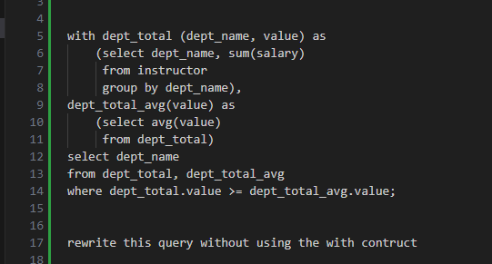
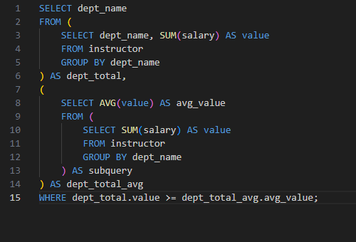

# DSC_E3.24

with dept_total (dept_name, value) as
    (select dept_name, sum(salary)
     from instructor
     group by dept_name),
dept_total_avg(value) as
    (select avg(value)
     from dept_total)
select dept_name
from dept_total, dept_total_avg
where dept_total.value >= dept_total_avg.value;

rewrite this query without using the with contruct

